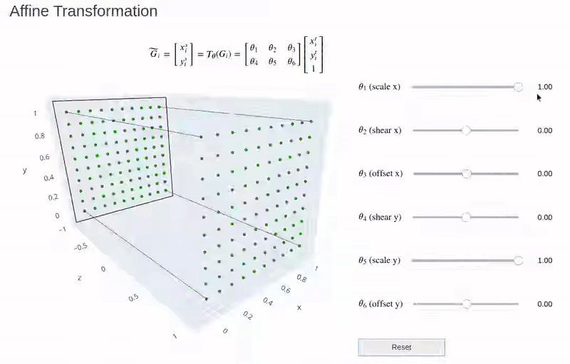

# Interactive Transformations

Jupyter notebooks containing interactive transformation visualizations using plotly and ipywidgets.

## Demos

**01_Affine_Transformation.ipynb**
  

**02_Attention_Transformation.ipynb**
  

**03_Projective_Transformation.ipynb**
  
